<div align="center">

# 🏛️ Restaurant — Premium Pakistani Fine Dining Website

### A luxury, fully-animated restaurant website built with Next.js 16, React 19, Tailwind CSS 4 & Framer Motion


</div>

---

## 📸 Screenshots

### Homepage — Hero Slider

> Full-screen hero with auto-rotating slides, staggered text animations, dot navigation, and scroll indicator.

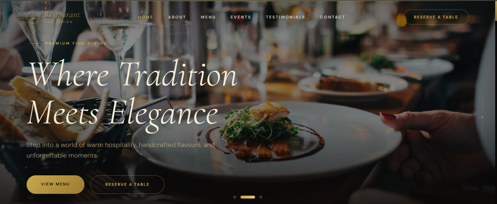

### Homepage — Feature Cards & About Snippet

> Three elevated feature cards (Opening Hours, Reservations, Awards) overlaid above the hero, followed by the About section with parallax imagery and gold decorative accents.

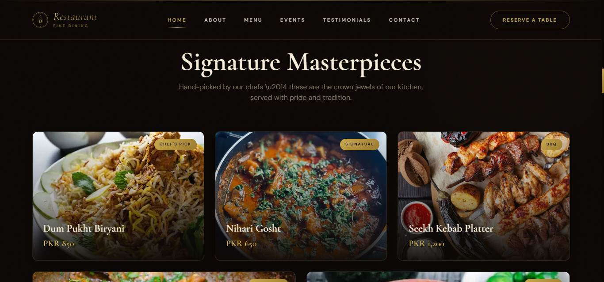

### Homepage — Featured Dishes

> Showcase of signature dishes with hover-scale images, elegant gold category badges, and pricing in PKR.

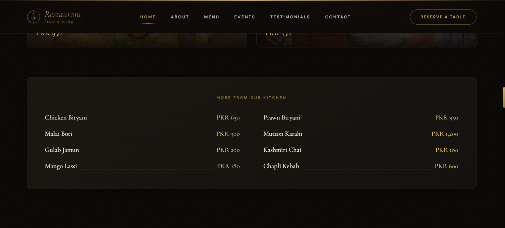

### Homepage — Chef Profiles & Stats Counter

> Meet the master chefs section with triple-ring avatar frames, animated count-up statistics, and staggered reveal animations.

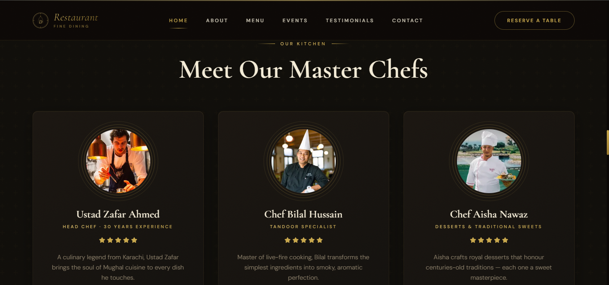

### Homepage — Reservation Form

> Luxury reservation form with split layout — hero image on the left, form fields with custom-styled date/time/guest pickers on the right.

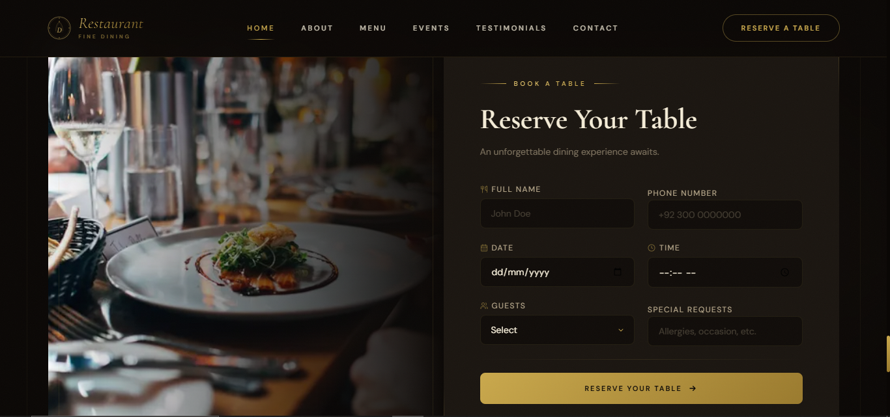

### Footer

> Full-width footer with logo, quick links, operating hours, newsletter subscription input, social icons, and gold divider accents.

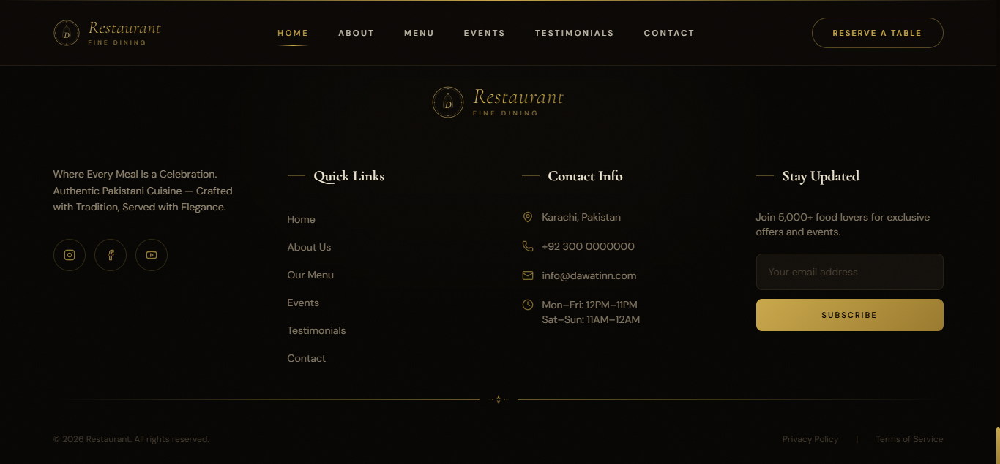

### About Page

> Page hero with label, heading, breadcrumbs and overlay. Story section, interactive timeline, core values cards, team grid with stars, and closing quote.

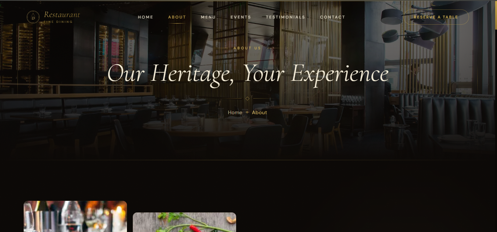

### Menu Page

> Sticky category tabs with pill-style active states, animated grid of menu items with image thumbnails, pricing, tags (bestseller, spicy, chef's pick), and a private dining CTA.

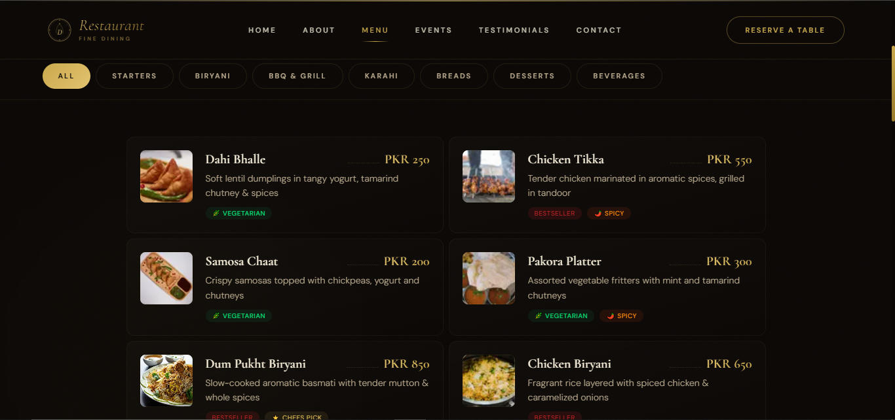

### Events Page

> Event cards with dual badges (category + status), date/time bar, hover lift effects, and a private & corporate events section.

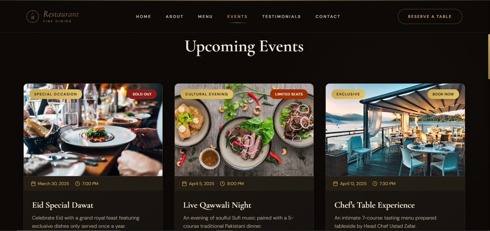

### Testimonials Page

> Masonry grid of review cards with star ratings, source badges (Google, TripAdvisor, Facebook), overall rating summary with animated progress bars, and video testimonial thumbnails.

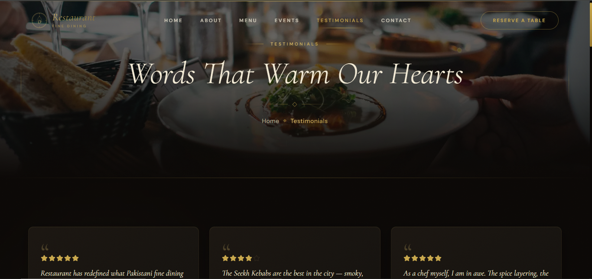

### Contact Page — Form & Info

> Contact information cards with icons, social links, and a premium contact form with validation, success state animation, and styled select dropdowns.

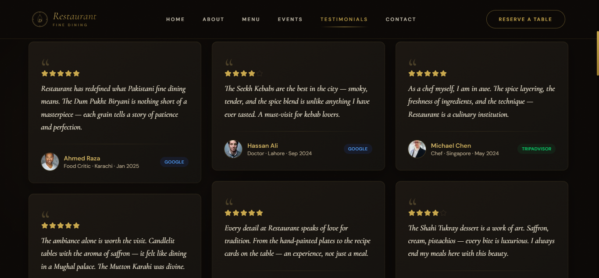

### Contact Page — Map & FAQ

> Embedded Google Maps with dark theme inversion, and an animated accordion FAQ section.

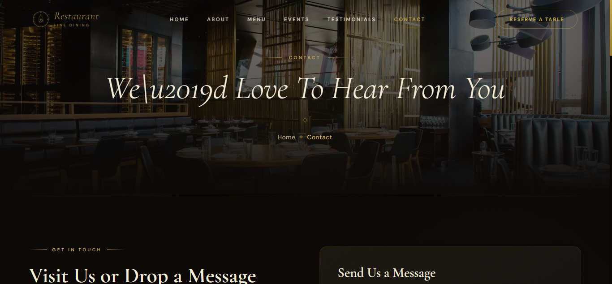

### Footer

> Full-width footer with logo, quick links, operating hours, newsletter subscription input, social icons, and gold divider accents.

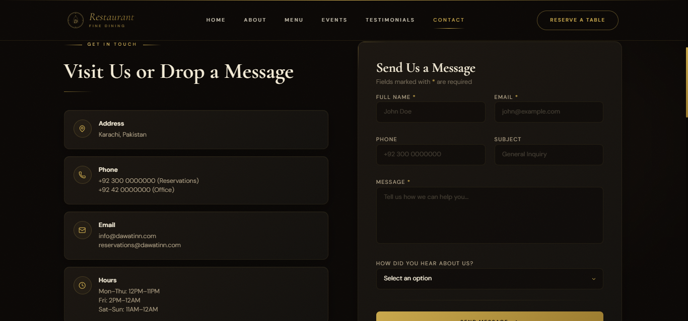

### Mobile Navigation

> Full-screen overlay mobile menu with decorative corner ornaments, centered logo variant, staggered link animations, and reserve button.

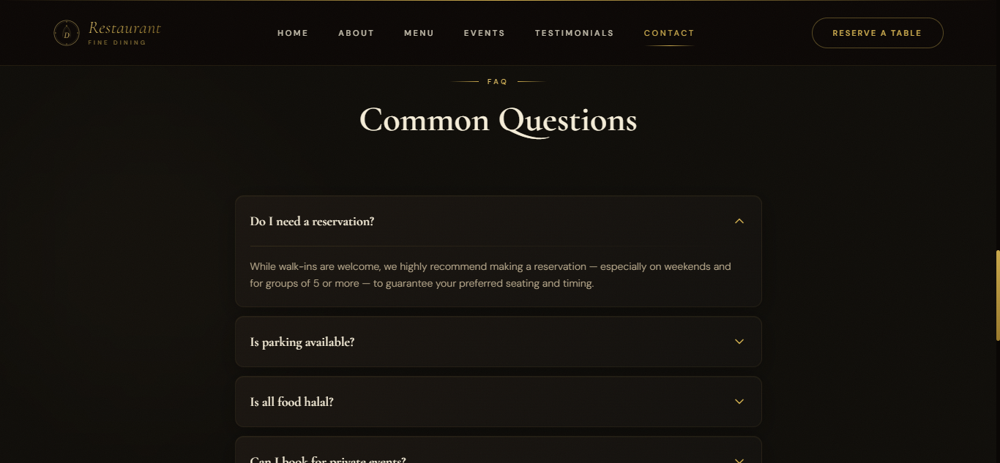

---

## ✨ Features

### 🎨 Design & Visual

- **Dark luxury theme** — Deep `#0A0705` background with rich gold (`#C9A84C`) and cream (`#F5EDD8`) accents
- **Custom color system** — 20+ custom CSS variables and Tailwind theme tokens for consistent branding
- **Gold gradient text** — Shimmer and static gold gradient utilities (`.text-gold-gradient`, `.text-gold-shimmer`)
- **Luxury card system** — Cards with inner glow, subtle borders, and hover shadow transitions (`.luxury-card`)
- **Premium buttons** — Two button styles: filled gradient (`.btn-luxury`) and outline with scale animation (`.btn-luxury-outline`)
- **Custom scrollbar** — Gold gradient scrollbar matching the theme
- **Noise texture overlay** — SVG-based film grain overlay at 2.5% opacity for premium texture
- **Ambient glow effects** — Subtle radial gradients placed throughout sections for depth
- **Vignette effects** — Inner box-shadows on hero sections for cinematic framing
- **Gold dividers** — Custom SVG diamond dividers with gradient lines (`GoldDivider` component)
- **Cursor glow** — A 300px radial gold glow that follows the mouse cursor on desktop

### 🎬 Animations & Interactions

- **Framer Motion throughout** — Every section uses `whileInView`, `AnimatePresence`, layout animations
- **Staggered reveals** — Container/item variant pattern for sequential element appearance
- **Hero auto-slider** — 5-second interval with crossfade and zoom transitions
- **Count-up statistics** — Numbers animate from 0 to target with `requestAnimationFrame`-style timing
- **Parallax images** — `useScroll` + `useTransform` for scroll-linked image movement
- **Animated text** — Reusable `AnimatedText` component with configurable delay
- **Scroll-triggered animations** — `useInView` hooks with `once: true` for one-time reveal
- **Video modal** — AnimatePresence-powered modal with backdrop blur for YouTube embed
- **Mobile menu** — Full-screen overlay with staggered link entrance and decorative corner ornaments
- **Active nav underline** — Framer Motion `layoutId` for smooth animated underline between nav links
- **Menu category filter** — Animated tab switching with `AnimatePresence` exit/enter transitions
- **FAQ accordion** — Smooth height animation with chevron rotation
- **Testimonial auto-scroll** — Infinite horizontal marquee using `motion.div` x-animation
- **Hover effects** — Scale transforms on images, card lift (`y: -8`), border glow transitions
- **Dot navigation** — Expanding pill indicator on hero slider

### 📱 Responsive Design

- **Mobile-first approach** — All layouts adapt from single column to multi-column grids
- **Responsive typography** — `text-4xl md:text-6xl lg:text-[100px]` scaling across breakpoints
- **Sticky navigation** — Background blur and opacity transitions on scroll
- **Mobile hamburger menu** — Full-screen overlay navigation for smaller screens
- **Sticky menu tabs** — Category filters stay pinned below navbar on scroll
- **Hidden decorative elements** — Side ornaments hidden below `xl` breakpoint

### 🏗️ Architecture

- **Next.js 16 App Router** — File-based routing with `app/` directory structure
- **React 19** — Latest React with improved performance
- **TypeScript strict mode** — Full type safety with interfaces for all data models
- **Client Components** — `'use client'` directive for interactive components
- **Modular component architecture** — 20+ components organized by feature domain
- **Centralized data layer** — Type-safe data files in `lib/data/` with exported interfaces
- **Path aliases** — `@/*` mapped to `./src/*` via tsconfig
- **Image optimization** — `next/image` with `remotePatterns` for Unsplash and Picsum
- **Font optimization** — `next/font/google` for Cormorant Garamond and DM Sans with CSS variables

---

## 🛠️ Tech Stack

| Technology | Version | Purpose |
|---|---|---|
| **Next.js** | 16.1.6 | React framework with App Router, SSR, image optimization |
| **React** | 19.2.3 | UI component library |
| **TypeScript** | 5.x | Type-safe development with strict mode |
| **Tailwind CSS** | 4.x | Utility-first CSS with `@theme inline` configuration |
| **Framer Motion** | 12.35.1 | Production-grade animations and gestures |
| **Lucide React** | 0.577.0 | Beautiful & consistent SVG icon library |
| **ESLint** | 9.x | Code linting with `next/core-web-vitals` and `next/typescript` |
| **PostCSS** | — | CSS processing via `@tailwindcss/postcss` plugin |

---

## 📁 Project Structure

```
next-restaurant/
├── public/                          # Static assets
├── screenshots/                     # Project screenshots (1.png – 14.png)
├── src/
│   ├── app/                         # Next.js App Router pages
│   │   ├── globals.css              # Global styles, CSS variables, custom utilities
│   │   ├── layout.tsx               # Root layout (fonts, navbar, footer)
│   │   ├── page.tsx                 # Homepage (9 sections composed together)
│   │   ├── about/
│   │   │   └── page.tsx             # About page (story, timeline, values, team, quote)
│   │   ├── contact/
│   │   │   └── page.tsx             # Contact page (info, form, map, FAQ)
│   │   ├── events/
│   │   │   └── page.tsx             # Events page (upcoming events, private events)
│   │   ├── menu/
│   │   │   └── page.tsx             # Menu page (category tabs, grid, private dining CTA)
│   │   └── testimonials/
│   │       └── page.tsx             # Testimonials (masonry grid, ratings, video reviews)
│   │
│   ├── components/
│   │   ├── home/                    # Homepage-specific sections
│   │   │   ├── AboutSnippet.tsx     # Brief about section with image grid
│   │   │   ├── ChefSection.tsx      # Master chefs grid with bios
│   │   │   ├── FeatureCards.tsx     # Three info cards (hours, phone, awards)
│   │   │   ├── FeaturedDishes.tsx   # Signature dishes showcase
│   │   │   ├── HeroSlider.tsx       # Full-screen auto-rotating hero
│   │   │   ├── ReservationCTA.tsx   # Reservation form with image split
│   │   │   ├── StatsSection.tsx     # Animated count-up statistics
│   │   │   ├── TestimonialSnippet.tsx  # Auto-scrolling testimonial ticker
│   │   │   └── VideoSection.tsx     # Parallax video CTA with modal
│   │   │
│   │   ├── layout/                  # Layout-level components
│   │   │   ├── Footer.tsx           # Global footer with links, hours, newsletter
│   │   │   └── Navbar.tsx           # Fixed navbar with scroll effects, mobile menu
│   │   │
│   │   ├── shared/                  # Reusable across multiple pages
│   │   │   ├── MenuCard.tsx         # Individual menu item card
│   │   │   └── PageHero.tsx         # Reusable page hero with breadcrumbs
│   │   │
│   │   └── ui/                      # Atomic UI components
│   │       ├── AnimatedText.tsx     # Scroll-triggered text reveal
│   │       ├── CursorGlow.tsx       # Mouse-following gold glow effect
│   │       ├── GoldDivider.tsx      # SVG diamond divider with gradient lines
│   │       ├── Logo.tsx             # Restaurant logo (3 variants: default, large, footer)
│   │       ├── ParallaxImage.tsx    # Scroll-linked parallax image wrapper
│   │       └── SectionLabel.tsx     # Gold gradient label with side lines
│   │
│   └── lib/
│       ├── utils.ts                 # Utility functions (cn class merger)
│       └── data/                    # Centralized static data
│           ├── events.ts            # 6 events with Event interface
│           ├── menu.ts              # 23 menu items across 8 categories with MenuItem interface
│           └── testimonials.ts      # 12 testimonials with Testimonial interface
│
├── eslint.config.mjs                # ESLint 9 flat config
├── next.config.ts                   # Next.js config (image remote patterns)
├── next-env.d.ts                    # Next.js TypeScript declarations
├── package.json                     # Dependencies and scripts
├── postcss.config.mjs               # PostCSS with Tailwind CSS plugin
└── tsconfig.json                    # TypeScript config (strict, path aliases)
```

---

## 📄 Pages In Detail

### 🏠 Homepage (`/`)

The homepage is composed of **9 distinct sections**, each its own component:

| # | Section | Component | Description |
|---|---|---|---|
| 1 | Hero Slider | `HeroSlider` | Full-screen image slider with 3 slides, auto-advances every 5s, staggered text animation, dot navigation, decorative side lines, scroll indicator |
| 2 | Feature Cards | `FeatureCards` | 3 cards (Opening Hours, Reservations, Awards) that float `-mt-20` over the hero with staggered reveal |
| 3 | About Snippet | `AboutSnippet` | 2-column layout with corner-bordered image grid + story text with "Learn More" link |
| 4 | Featured Dishes | `FeaturedDishes` | 5 signature dishes shown in a staggered grid with hover zoom, price badges, and gold category labels |
| 5 | Chef Section | `ChefSection` | 3 chef profiles in cards with triple-ring avatar frames, bios, and "Meet Our Chefs" heading |
| 6 | Stats Section | `StatsSection` | 4 animated count-up statistics (25+ Years, 150+ Dishes, 50,000+ Guests, 12 Chefs) with gold gradient background |
| 7 | Video Section | `VideoSection` | Parallax background with play button → opens a Framer Motion modal with YouTube embed |
| 8 | Testimonials | `TestimonialSnippet` | Infinite horizontal auto-scrolling testimonial cards with star ratings |
| 9 | Reservation CTA | `ReservationCTA` | Split layout: left image + right form (name, phone, date, time, guests, requests) with success state |

### 📖 About Page (`/about`)

| Section | Description |
|---|---|
| Page Hero | Reusable hero with "About Us" label, heading, breadcrumbs, and background image |
| Our Story | 2-column: 4-image offset grid + narrative paragraphs about the restaurant's founding |
| Timeline | 5 milestones (1998–2024) on a vertical line with alternating left/right layout and pulsing gold dots |
| Our Values | 3 cards: Authenticity, Quality, Heritage — each with icon, title, and description |
| Our Team | 4 chefs in a grid with triple-ring circular avatars and 5-star ratings |
| Mission Quote | Centered decorative blockquote with gold dividers |

### 🍽️ Menu Page (`/menu`)

| Section | Description |
|---|---|
| Page Hero | Hero banner with "Our Menu" label |
| Category Tabs | **Sticky** pill-style tabs for 8 categories (All, Starters, Biryani, BBQ & Grill, Karahi, Breads, Desserts, Beverages) with gold gradient active state |
| Menu Grid | 2-column grid of `MenuCard` components with animated enter/exit on category switch. Each card shows image, name, price (PKR), description, and tags |
| Private Dining CTA | Centered call-to-action for private dining with "Enquire Now" button |

**Menu Data:** 23 items across 8 categories with tags like `bestseller`, `spicy`, `chefs-pick`, `vegetarian`.

### 🎉 Events Page (`/events`)

| Section | Description |
|---|---|
| Page Hero | Hero with "Events" label |
| Upcoming Events | 3-column grid of 6 event cards. Each has a cover image with dual badges (category + status: SOLD OUT / LIMITED SEATS / BOOK NOW / FREE ENTRY / SEASONAL), date/time bar, title, description, and "Register Interest" button |
| Private & Corporate | 2-column: text content with a list of services (Weddings, Corporate Events, etc.) + large image |

### ⭐ Testimonials Page (`/testimonials`)

| Section | Description |
|---|---|
| Page Hero | Hero with "Testimonials" label |
| Masonry Grid | CSS `columns-3` masonry layout of 12 review cards. Each shows a decorative opening quote mark, star rating, review text, divider, avatar, name/designation/city/date, and source badge |
| Rating Summary | Giant "4.9/5" score with 5 stars, 5-bar animated breakdown (82% 5-star, etc.), and source logos |
| Video Reviews | 3 video thumbnail cards with play button and triple-ring hover effect |

### 📞 Contact Page (`/contact`)

| Section | Description |
|---|---|
| Page Hero | Hero with "Contact" label |
| Contact Info | 4 info cards (Address, Phone, Email, Hours) + 3 social media icon buttons |
| Contact Form | Name*, Email*, Phone, Subject, Message*, Source dropdown. Client-side validation with error states. Animated success confirmation with "Send Another Message" option |
| Map | Full-width embedded Google Map with dark theme via CSS `invert(90%) hue-rotate(180deg)` filter |
| FAQ | 6-item accordion with animated height expansion and chevron rotation |

---

## 🧩 Component Reference

### UI Components (`src/components/ui/`)

| Component | Props | Description |
|---|---|---|
| `AnimatedText` | `children`, `className?`, `delay?` | Wraps content with fade-up-on-scroll animation |
| `CursorGlow` | — | Fixed 300px radial gold glow following mouse cursor (desktop only) |
| `GoldDivider` | `className?` | Decorative SVG diamond divider with gradient side lines |
| `Logo` | `variant?: 'default' \| 'large' \| 'footer'`, `className?` | Restaurant logo with SVG crest monogram, 3 size variants |
| `ParallaxImage` | `src`, `alt`, `className?`, `speed?` | Scroll-linked vertical parallax effect on images |
| `SectionLabel` | `children`, `centered?` | Gold gradient uppercase label with decorative side lines |

### Shared Components (`src/components/shared/`)

| Component | Props | Description |
|---|---|---|
| `PageHero` | `label`, `heading`, `breadcrumbs`, `image` | Reusable page banner with overlay, breadcrumbs, and decorative elements |
| `MenuCard` | `item: MenuItem` | Individual menu item display with image, name, price, description, tags |

### Layout Components (`src/components/layout/`)

| Component | Description |
|---|---|
| `Navbar` | Fixed header with scroll-aware transparency, backdrop blur, animated underline, mobile overlay menu |
| `Footer` | Full footer with logo, quick links, opening hours, newsletter signup, social icons |

---

## 🎨 Design System

### Color Palette

| Token | Hex | Usage |
|---|---|---|
| `gold` | `#C9A84C` | Primary accent, buttons, highlights |
| `gold-light` | `#E4C46E` | Gradient endpoints, hover states |
| `gold-dark` | `#9A7A2E` | Gradient endpoints, shadows |
| `gold-soft` | `#D4B66A` | Subtle accents |
| `crimson` | `#8B1A1A` | Alert badges, "Sold Out" status |
| `crimson-light` | `#B52020` | Form validation errors |
| `cream` | `#F5EDD8` | Primary text color |
| `cream-muted` | `#B8A98C` | Secondary/muted text |
| `dawat-bg` | `#0A0705` | Page background |
| `dawat-card` | `#1A1510` | Card backgrounds |
| `dawat-section` | `#0F0D09` | Alternating section backgrounds |
| `dawat-secondary` | `#12100D` | Secondary background |
| `dawat-border` | `#2A2218` | Border color |
| `champagne` | `#F7E7CE` | Shimmer highlight |

### Typography

| Font | CSS Variable | Usage |
|---|---|---|
| **Cormorant Garamond** | `--font-cormorant` | Headings, quotes, prices — italic serif with luxury feel |
| **DM Sans** | `--font-dm-sans` | Body text, labels, buttons — clean modern sans-serif |

Weights loaded: Cormorant (300–700, normal + italic), DM Sans (300–600).

### Custom Animations

| Animation | Duration | Description |
|---|---|---|
| `fadeUp` | 0.8s | Opacity 0→1 with Y translate 40px→0 |
| `fadeIn` | 1s | Simple opacity 0→1 |
| `shimmer` | 2.5s | Background position sweep for gold shimmer text |
| `float` | 6s | Gentle Y-axis oscillation (0 → -12px → 0) |
| `goldPulse` | 3s | Opacity 0.4→0.8→0.4 pulsing |
| `borderGlow` | 4s | Border color alpha 0.15→0.35→0.15 |

---

## 📦 Data Models

### `MenuItem` (`src/lib/data/menu.ts`)

```typescript
interface MenuItem {
  id: number
  name: string
  category: string      // 'starters' | 'biryani' | 'bbq' | 'karahi' | 'breads' | 'desserts' | 'beverages'
  price: number         // Price in PKR
  description: string
  tags: string[]        // 'bestseller' | 'spicy' | 'chefs-pick' | 'vegetarian'
  image: string         // Unsplash URL
}
```

**23 items** across **8 categories**.

### `Event` (`src/lib/data/events.ts`)

```typescript
interface Event {
  id: number
  title: string
  date: string
  time: string
  description: string
  image: string
  badge: string        // 'SOLD OUT' | 'LIMITED SEATS' | 'BOOK NOW' | 'FREE ENTRY' | 'SEASONAL'
  category: string
}
```

**6 events** with unique badge/status combinations.

### `Testimonial` (`src/lib/data/testimonials.ts`)

```typescript
interface Testimonial {
  id: number
  name: string
  designation: string
  city: string
  date: string
  rating: number       // 1–5
  quote: string
  source: string       // 'Google' | 'TripAdvisor' | 'Facebook'
  avatar: string       // Unsplash URL
}
```

**12 testimonials** from reviewers across 7 cities and 3 platforms.

---

## 🚀 Getting Started

### Prerequisites

- **Node.js** 18.17 or later
- **npm**, **yarn**, **pnpm**, or **bun**

### Installation

```bash
# Clone the repository
git clone https://github.com/your-username/next-restaurant.git
cd next-restaurant

# Install dependencies
npm install
```

### Development

```bash
# Start the development server
npm run dev
```

Open [http://localhost:3000](http://localhost:3000) in your browser. The app hot-reloads as you edit files.

### Production Build

```bash
# Create an optimized production build
npm run build

# Start the production server
npm start
```

### Linting

```bash
# Run ESLint
npm run lint
```

---

## ⚙️ Configuration

### Next.js (`next.config.ts`)

- **Image remote patterns** — Allows optimized images from `images.unsplash.com` and `picsum.photos`

### Tailwind CSS (`globals.css`)

- Uses Tailwind CSS v4's `@theme inline` directive for custom tokens
- Custom CSS utility classes: `.text-gold-gradient`, `.text-gold-shimmer`, `.luxury-card`, `.btn-luxury`, `.btn-luxury-outline`, `.gold-line`
- Custom scrollbar, selection colors, and noise texture overlay

### TypeScript (`tsconfig.json`)

- **Strict mode** enabled
- **Path alias** `@/*` → `./src/*`
- **Target** ES2017 with ESNext module resolution (bundler)

### ESLint (`eslint.config.mjs`)

- ESLint 9 flat config format
- Extends `eslint-config-next/core-web-vitals` and `eslint-config-next/typescript`

---

## 📱 Browser Support

- Chrome / Edge (latest)
- Firefox (latest)
- Safari (latest)
- Mobile Safari / Chrome on iOS & Android

---

## 📄 License

This project is for educational and portfolio purposes.

---

<div align="center">

**Built with ❤️ using Next.js, Tailwind CSS & Framer Motion**

</div>

Check out our [Next.js deployment documentation](https://nextjs.org/docs/app/building-your-application/deploying) for more details.
